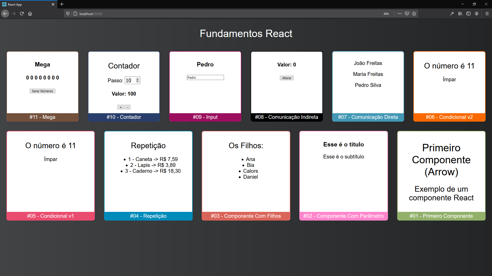

# [Cod3r Cursos](https://www.cod3r.com.br)

### [Repositório no GitHub](https://github.com/cod3rcursos/youtube/tree/master/fundamentos-react)

- [React JS Curso Rápido ⚛️ Masterclass #1 2020 - 100% Prático!](https://www.youtube.com/watch?v=XQxitgyZ_S4)

```
npx create-react-app fundamentos-react
```

```
npm start
```

**[JSX](https://reactjs.org/docs/introducing-jsx.html)**  
**[props](https://reactjs.org/docs/components-and-props.html)**  

- [React JS Curso Rápido ⚛️ Masterclass #2 2020 - 100% Prático!](https://www.youtube.com/watch?v=GJ8Vm-h0V8I)

**[Hooks](https://reactjs.org/docs/hooks-intro.html)**  
**[useState](https://reactjs.org/docs/hooks-reference.html#usestate)**  
**[Forms](https://reactjs.org/docs/forms.html)**  
**[Controlled Components](https://reactjs.org/docs/forms.html#controlled-components)**  

### Screenshot

